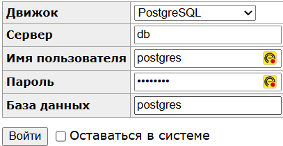

# One time secret

[](https://github.com/alexpro2022/one_time_secret/actions/workflows/flow_ci_cd.yaml)
[](https://github.com/alexpro2022/one_time_secret/actions/workflows/flow_branch_test.yaml)


#### Задание:
Разработать HTTP-сервис на FastAPI, в котором можно хранить конфиденциальные данные (далее — «секреты»).
  * Все «секреты» должны храниться в зашифрованном виде (не в открытом тексте).
  * По истечении заданного срока (ttl_seconds) «секрет» становится недоступен. Необходимо обеспечить периодическую или событийную очистку просроченных секретов (с учётом кеша).
  * Секрет обязательно должен выдаваться только один раз: после первого запроса к нему по уникальному ключу он становится недоступным.
	- После первого прочтения «секрет» не должен более возвращаться.
	- При удалении по запросу пользователя «секрет» также становится недоступен.

<br>


## Оглавление
- [Технологии](#технологии)
- [Описание работы](#описание-работы)
- [Установка приложения](#установка-приложения)
- [Виртуальное окружение](#виртуальное-окружение)
- [Разработка в Docker](#Разработка-в-Docker)
- [Удаление приложения](#удаление-приложения)
- [Автор](#автор)

<br>


## Технологии
<details><summary>Подробнее</summary><br>

[](https://www.python.org/)
[](https://fastapi.tiangolo.com/)
[](https://docs.pydantic.dev/)
[](https://www.postgresql.org/)
[](https://pypi.org/project/asyncpg/)
[](https://www.sqlalchemy.org/)
[](https://alembic.sqlalchemy.org/en/latest/)
[](https://www.uvicorn.org/)
[](https://www.docker.com/)
[](https://docs.docker.com/compose/)
[](https://hub.docker.com/)
[](https://docs.github.com/en/actions)
[](https://www.python-httpx.org/)
[](https://docs.pytest.org/en/latest/)
[](https://pypi.org/project/pytest-asyncio/)
[](https://pytest-cov.readthedocs.io/en/latest/)
[](https://pre-commit.com/)

[⬆️Оглавление](#оглавление)

---

</details>
<br>


## Описание работы:

Проект развернут на удаленном сервере.
Техническая документация:
  - Swagger: http://185.221.162.231:9000/docs
  - Redoc: http://185.221.162.231:9000/redoc


Для разработки используются эндпойнты по адресу:
http://185.221.162.231:9000/docs#/Development<br>
Сервисные эндпойнты по адресу:
http://185.221.162.231:9000/docs#/Secrets<br>
Администрирование БД может быть осуществлено через админ панель по адресу:
http://185.221.162.231:9001<br>
Учетные данные для входа в админ-зону:<br>
Пароль: `postgres`<br>


[⬆️Оглавление](#оглавление)

<br>


## Установка приложения:
Клонируйте репозиторий с GitHub и введите данные для переменных окружения (значения даны для примера, но их можно оставить):

```bash
git clone https://github.com/alexpro2022/one_time_secret.git
cd one_time_secret
cp .env.example .env
nano .env
```
Все последующие команды производятся из корневой директории проекта.

[⬆️Оглавление](#оглавление)

<br>


## Разработка в Docker:
   <details><summary>Предварительные условия</summary><br>

   Предполагается, что пользователь установил [Docker](https://docs.docker.com/engine/install/) и [Docker Compose](https://docs.docker.com/compose/install/) на локальной машине. Проверить наличие можно выполнив команды:

   ```bash
   docker -v && docker compose version
   ```

   ---

   </details>
<br>

1. Запуск тестов - после прохождения тестов в консоль будет выведен отчет `pytest` и `coverage`(**xx%**):
```bash
docker compose -f docker/dev/test.docker-compose.yaml --env-file .env up --build --abort-on-container-exit && \
docker compose -f docker/dev/test.docker-compose.yaml --env-file .env down --volumes && docker system prune -f
```
<br>

2. Запуск приложения - проект будет развернут в docker-контейнерах по адресу http://localhost:9000/docs:
```bash
docker compose -f docker/dev/docker-compose.yaml --env-file .env up --build --detach
```
Для работы удобно использовать режим режим разработки:
```bash
docker compose -f docker/dev/docker-compose.yaml --env-file .env watch --prune --quiet
```
<br>

3. Остановить docker и удалить контейнеры можно командой:
```bash
docker compose -f docker/dev/docker-compose.yaml --env-file .env down && docker system prune -f
```

Если также необходимо удалить том базы данных:
```bash
docker compose -f docker/dev/docker-compose.yaml --env-file .env down --volumes && docker system prune -f
```

[⬆️Оглавление](#оглавление)


<br>


## Удаление приложения:
```bash
cd .. && rm -fr one_time_secret
```

[⬆️Оглавление](#оглавление)

<br>


## Автор:
[Aleksei Proskuriakov](https://github.com/alexpro2022)

[⬆️В начало](#project_name)
